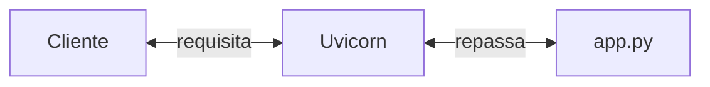
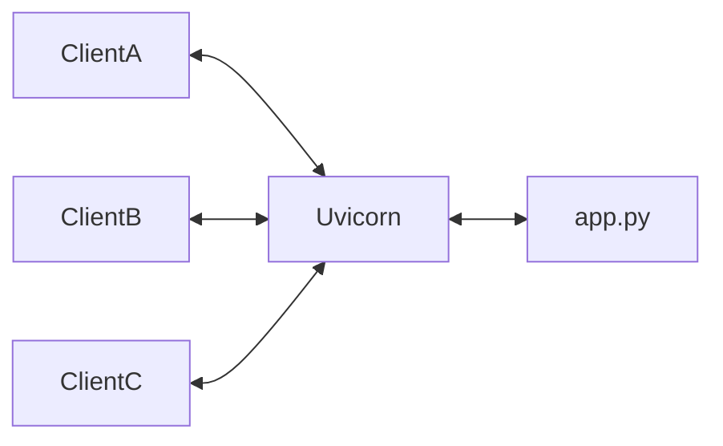
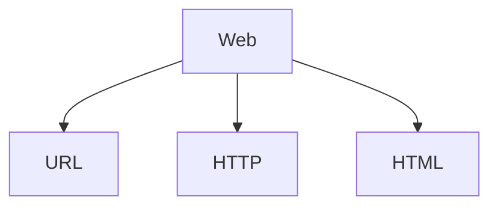

Quando uma maquina, e o tanto o client quando o servidor, isso recebe o nome de loopback (A maquina processa tudo)

Arquitetura mais importante e a arquitetura Cliente-Servidor

quando eu executo o comando fastapi dev src/app.py, ele serve a aplicacao python e via cliente acessamos e conseguimos "consumir" a informacao/mensagem


## Uvicorn
O uvicorn e a ferramenta reponsavel por permitir que o python disponilize as coisas na rede. Entao ele e quem de fato e o responsavel por servir a aplicacao, entao ele e o que o pessoal em back-end chama de servidor de aplicacao porque de fato e o que esta ocorrendo ele esta servindo o app.py

> OBS: FastAPI nao e de fato o servidor, pois ele esta por debaixo dos panos rodando o uvicorn que e realmente que serve a aplicacao

Como falado anteriormente o **Uvicorn** e um servidor de aplicacao. Tecnicamente ele e um **ASGI**, *Asynchronous server gateway interface* - basicamente e quem processa as requisicoes e as devolve para o client, lembrando que **trabalhamos normalmente com arquitetura cliente servidor**



Como o uvicorn e de fato o responsavel pelo servidor de aplicacao e quem chama o uvicorn e o FastAPI, podemos se for do interesse informar o comando manualmente como sendo:

```zsh
uvicorn src.app:app
```
Logo, podemos concluir que podemos subir o Uvicorn manualmente sem a dependencia do FastAPI

---

### A rede local e a porta de Loopback
Ate o dado momento estamos utilizando o que chamamos de "loopback" ou seja o nossa maquina e tanto o cliente quanto o servidor ao mesmo tempo.

O que nao e muito pratico ainda, pois queremos fazer uma apliccao para diversos clientes


Neste caso, que estamos nao consigo passar para alguem e pedir para que essa pessoa acesse, eu ate consigo servir varios browsers diferentes por exemplo acessar um GoogleChrome consumindo deste servidor de aplicacao que foi levantado pelo uvicorn, consigo fazer o mesmo no Mozilla Firefox simultaneamente mas nao consig passar por exemplo para um amigo tentar acessar porque a maquina e Cliente e Servidor ao mesmo tempo.

Porem, eu posso servir este servidor de aplicacao na rede local (LAN) - *Local Area Network*

Assim, toda a rede domestica ou empresarial ja podem acessar a aplicacao caso saibam o ip.

Veja entao como podemos executar para que possas na mesma rede possam ver

```bash
fastapi dev src/app.py --host 0.0.0.0
```

---

## Modelo padrao da web



- URL: **Localizador uniforme de recursos**. Um endereco de rede pelo qual podemos nos comunicar com um computador na rede tudo que tem na web e um recurso que esta em um servidor que eu quero acessar.
- HTTP: *Hyper Text Transfer Protocol*  um protocolo(um padrao de comunicacao) que especifica como deve ocorrer a comunicacao entre dispositivos (um conjunto de regras de como vamos estabelecer a comunicacao). O **http utiliza por padrao a porta 80**
- HTML: e a linguagem usada para criar e estruturar paginas na web.


### URL

A URL carinhosamente chamada de recurso ela pode ser divida em pequenas partes onde cada parte representa algo no corpo da url, sendo:

- http:// - **representa o protocolo**;
- 127.0.0.1 - **representa o endereco: ip ou DNS**
- 8000 - **representa a porta** (64.000 posiveis)
- /caminho - **onde esta o que queremos acessar**
- /recurso - **a identificacao do que queremos**
- ?query - **representa um filtro do recurso**
- #fragmento - **especifica um pedacao do recurso**


### HTML
HTTP, ou **HyperText Transfer Protocol** e o protocolo fundamental da Web como conhecemos hoje. Ele se tornou fundamental pois permite a transferencia de dados e comunicacao entre clientes e servidores. Ele baseia-se no modelo de requisicao-resposta: onde o cliente faz uma requisicao ao servidor, que responde a essa requisicao. Essas rquisicoes e respostas sao formatadas conforme as regras do protocolo HTTP.

No contexto do `HTTP`, **tanto requisicoes quanto as respostas sao referidas como mensagens** ou seja sempre que estamos trafegando dados significa que estavamos enviado ou trocando uma mensagem entre cliente e servidor. As mensagens HTTP na versao 1 tem uma estrutura textual semelhante ao seguinte exemplo:


HTTP - Mensagem de Requisicao - (Cabecalho/Headers)

```bash
    GET / HTTP/1.1 # O caminho que estou pegando
    Accept: */* # "Aceita qualquer coisa *"
    Accept-Encoding: gzip, deflate # Compacta os arquivos para trafegar menos texto na rede
    Connection: keep-alive # Tipo de conexao que mantem tudo ligado conectado
    Host: 127.0.0.1:8000 # O Host que ta solicitando (ip de quem fez o pedido)
    User-Agent: HTTPie/3.2.2 # E quem faz a request, nome do browser que esta fazendo a requisicao, ex: (Mozila)

```

HTTP - Mensagem de resposta - (Corpo/payload) O corpo normalmete e quando um usuario interage com a aplicacao porque o servidor precisa
executar um determinado comportamento entao **neste caso eu posso passar o corpo(body) na reqtuisicao** porque preciso enviar para o servidor os dados do cadastro de um novo usuario por exemplo ou quando publico um post no instagram estou dizendo na mensagem por favor instagram guarde isso no seu banco de dados. Mas tambem recebo o corpo na response que e o mais intuitivo quando por exemplo abro o facebook via corpo da response eu recebo o body ou payload contendo a lista de amigos por exemplo.

```bash
    HTTP/1.1 200 OK # Fez conexao via HTTP to devolvendo o OK que e o STATUS Code 200 (Deu certo)
    content-length: 24 # tamanho da mensagem em bytes
    content-type: application/json
    date: Fri, 19 Jan 2024 04:05:50 GMT
    server: uvicorn
    
    {
        "message": "Ola mundo"
    }

```

De maneira geral, o que define se o que sera enviado na mensagem ou seja (request/response) a grosso modo e o verbo (GET,POST,PUT,DELETE)
pois o body(corpo) pode estar presente tanto na response quanto na request e tudo vai depender do verbo. Um POST por exemplo eu envio o corpo da mensagem na requisicao. Ou seja, tanto o cabecalho quanto o body.

HTTP - Tipos de Cabecalho

O cabecalho da mensagem contem metadados sobre a requisicao ou resposta, existem diversos cabecalhos ja pre-definidos entretanto e possivel criar cabecalhos a medida em que for necessario.

Para encontrar mais informacoes pode-se chegar mais a fundo da documentacao do IANA ou do Mozila. Veja alguns tipos de cabecalhos pre definidos:

- Content-type: O tipo de midia que sera transmitida no corpo da mensagem ou payload. Por exemplo, `application/json` indica que o corpo
da mensagem esta em formato JSON. E sera `text` ou `html`, para mensagens que contem HTML.
- Authorization: Usado para autenticacao, como tokens ou credenciais
- Accept: Especifica o tipo de midia que o client aceita, como application/json.
- Server: Fornece informacoes sobre o software do servidor. 


HTTP - Verbos
Quando um cliente faz uma requisicao HTTP, ele indica sua intencao ao servidor com verbos:

- **GET**: utilizado para recuperar recursos ("Mensagem para pegar coisas"). Quando queremos solicitar um dado ja existente no servidor.
- **POST**: permite criar um novo recurso ("Mensagem para criar coisas"). Por exemplo, enviar/criar dados de cadastro de um novo usuario
- **PUT**: atualiza faz uma mundanca nos recursos existentes. Como, por exemplo, atualizar as informacoes de um usuario existente (alterar nome, foto de perfil e etc.)
- **DELETE**: Exclui um recurso. Por exemplo, remover um cadastro de algum usuario do sistema

> Existem outros diversos tipos de verbos como PATCH/HEAD, porem os mais comuns sao estes 4 verbos

### HTTP - Codigos de resposta

- 1xx: informativo - utilizada para enviar infos para o cliente de que sua requisicao foi recebida e esta sendo processada (so recebe muda nada, a recebi aqui "depois" eu vejo)

- 2xx: sucesso - indica que a requisicao foi bem sucedida (por exemplo, 200 = OK, 201 = Created), indica que tudo foi bem.

- 3xx: redirecionamento - informa que mais acoes sao necessarias para completar a requisicao (por exemplo, 301 Moved permanently, 302 Found).

- 4xx: erro no cliente - Significa que houve, um erro na requisicao pelo lado do cliente significa que quando vemos um erro do tipo da familia iniciando com 4 e porque o cliente fez "caquinha na requisicao". (400 = Bad request, 404 = Not found)

- 5xx: erro no servidor - Indica um erro no servidor ao procesar a requisicao valida do cliente, ou seja e quando o servidor fez caquinha ou quando o servidor envia como resposta uma mensagem que nao conseguimos saber o que fazer com ela. Exemplo: 500 Internal Server Error, 503 Service Unavailable

> OBS: Mais infos sobre os status codes da WEB esta disponivel no IANA.

### Codigos importantes

- 200 OK: a solicitacao foi bem sucedida. O significado depende do metodo HTTP utilizado na solicitacao
- 201 Created: a solicitacao foi bem sucedida e um novo recurso foi criado como resultado.
- 404 Not found: o recurso solicitado nao pode ser encontrado, sendo frequentemente usado quando o recurso e inexistente
- 422 Unprocessable Entity: usado quando a requisicao esta bem-formada, mas nao pode ser seguida devido a erros semanticos. E comum em APIs ao validar dados de entrada.
- 500 Internal Server Error: quando existe um erro na nossa aplicacao (toda vezes que fizer cacaquinha)


> Por padrao o FastAPI retorna sempre o status code 200 OK, mas voce pode passar via parametro nomeado o valor do que voce quer por exemplo:

```python
from fastapi import FastAPI

app = FastAPI()

@app.get('/', status_code = 201)
read_root():
return {'msg': 'Ola!'}
```

### HTML

O HTML e o teceiro pilar fundamental da web e o HTML, sigla para Hypertext Markup Language. Trate-se da linguagem de marcacao padrao usada para criar e estruturar paginas na internet. Quando acessamos um site, o que vemos em nossos navegadores e o resultado da interpretacao do HTML. Essa linguagem utiliza uma serie de tags - ocmo: <html>, <head>,<body> e etc. Sem elas nos veriamos tudo na web como sendo apenas mensagens JSON e seria bem estranho.

> Por padrao o response_class ou tambem chamado de response_type do FastAPI e um arquivo JSON, porem o FastAPI nos da a possibilidade de passarmos por exemplo ter como padrao de response do FastAPI uma pagina html entao quando um verbo for executado por exemplo o FastAPI devolve uma pagina HMTL.

O FastAPI, tambem trabalha com templates entao e possivel fazer mais coisas com o Jinja2 e etc.

Entretanto, no escopo do estudo iremos lidar apenas com APIs JSON. Entao e o unico tipo que dados que vamos operar e com dados JSON. E vamos trabalhar bastante com `response_model`


### APIs
APIs (Application Programming Interfaces), que frequentemente utilizam JSON para troca de dados. JSON e um formato leve de troca de dados, facil de ler e escrever para humanos, e simples de interpretar e gerar para maquinas.

Se pudermos fazer uma analogia, uma porta para abrirmos temos uma interface um meio onde interagimos com ela que por exemplo pode ser a macaneta da porta, buraco de chave um mecanismo de trancar a porta e etc. E entao quando falamos de API, estamos englobando todo estes elementos como HTML,JSON,HTTP,URL Cabecalho corpo da mensagem e etc tudo isso faz parte da interface de interecao com uma determinada API.

**Erroneamente, ou melhor dizendo conceitualmente a comunidade de computacao difunde que uma Rest API e uma API que trafega dados JSON, entretanto isso e um erro. Para que seja uma API seja do tipo REST obrigatoriamente ela deve trafegar mensagens HTML. Entao uma API que troca JSON nao e REST ela e apenas um RPC, comunicacao de maquina apenas troca dados.**

### JSON
Quando discutimos APIs ditas "modernas", nos referimos a APIs que priorizam o trafego de dados, deixando de lado a camada de apresentacao, como o HTML que o cliente consegue ler e etc. Porem o utiliar JSON e uma otima maneira de se transmitir dados, se tranto de um formato leve e agnostico se trafega menos dados e etc.

O objetivo entao e transmitir dados de forma agnostica para diferentes tipos de clientes. Nesse contexto, o JSON se tornou a midia padrao, gracas a sua leveza e facilidade de leitura tanto por humanos quanto por maquinas, resumindo JSON virou o padrao de quase tudo que troca dados na atualidade e pricipalmente na web.

### Contratos
Como o JSON nao possui uma **hierarquia** ou ordem de leitura por exemplo de onde o cliente pode comecar a ler ou no objeto recebido pela mensagem e comum que firmemos contratos entre o cliente e o servidor. 

Ou seja, o **servidor firma um contrato com o cliente** delimitando algumas coisas como por exemplo: "Olha vou te enviar ai na mensagem um objeto JSON, que ele vai ter os campos titulo,autor,data" etc e esses dados vao ser sempre do tipo int,string e int e entao saiba que voce sempre vai receber isso".

Mais tecnicamente falando quando, estamos lidando com compartilhamento de `JSON` **entre cliente e servidor**, e crucial estabelecer um entendimento mutuo sobre a estrutura dos dados que serao trocados. A este entendimento, denominamos de **schema**, o schema atua como um contrato definindo a forma e conteudo dos dados trafegados. (serve para documentar o **"esquema"** que foi combinado entre cliente e servidor). Ou tambem cendo uma "ferramenta" que podemos utilizar para saber o que se deve retornar em um determinado end-point

### Pydantic

Para que possamos garantir estes esquema este contrato sobre a troca de informacoes entre cliente e servidor utilizamos o Pydantic, que traduzindo pode ser algo como pedante algo ou alguem que e muito chato burocratico. A lib Pydantic tem a responsabilidade de documentar os dados que fornecemos pra ele da nossa API atuando como um advogado. Ele fica validando, como que foi trocado a mensagem por exemplo o servidor enviou: "mil novessentos e noventa e dois" ele vai dizer opa nao era esperado o formato int: 1982.

Tecnicamente dentro do universo de APIs e contratos de dados, especialmente ao trabalhar com Python
o Pydantic se destaca como uma ferramenta poderosa e versatil. Alem de embutida ja no FastAPI, a ideia dele e criar uma camada de documentacao, via OpenAPI, e de fazer a validacao dos modelos de entrada e saida da nossa API.